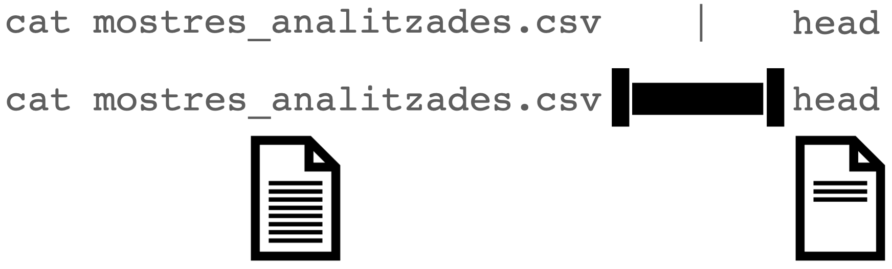
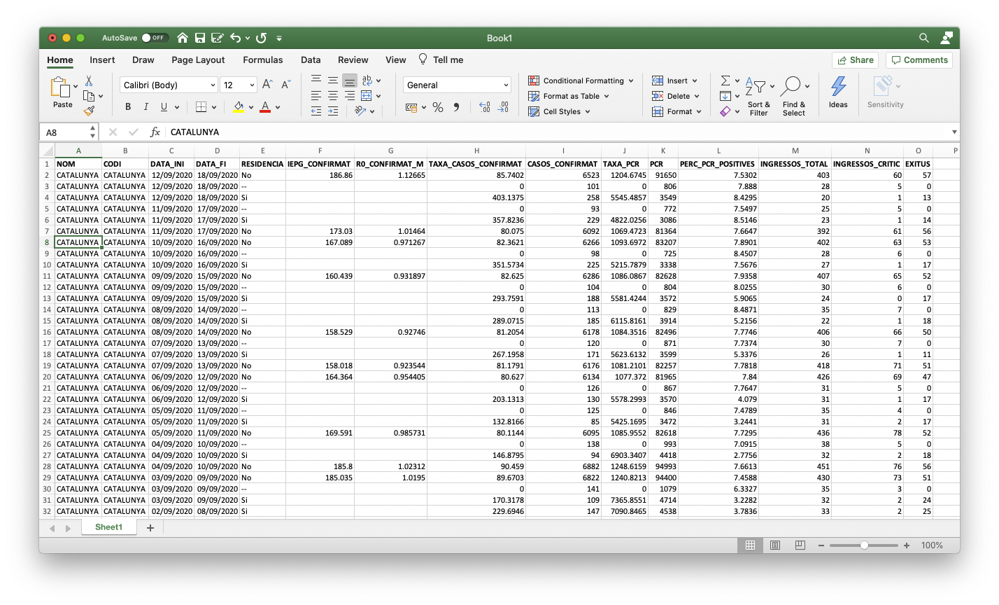

# Objectives

The learning objectives for this practical are:

 * Use a text editor to write your Unix scripts.
 * Chain Unix commands using pipes.
 * Extract rows and columns.
 * Sorting lines.
 * Counting occurrences.
 * Pasting columns.

# Setup and background

We will download again some COVID19 data. Please follow the next two steps:

1. Go to the Catalan Health Departament COVID data portal at [https://dadescovid.cat](https://dadescovid.cat)
   and switch the language to "ENGLISH" using the pull-down menu on the top-right corner of the page.
2. Follow the downloads link and on the next page click and download the two
   files corresponding to the "7 DAY AGGREGATION" for "CATALUNYA" and "COUNTIES"
   ("COMARQUES" in Catalan) for the "RESIDENCE/GENERAL" population. It is
   important that you download both files in the same day to make them comparable,
   because all data is updated daily. Make sure you know
   exactly where in your filesystem these two files have been downloaded.
   **Tip:** some browsers automatically download files into a folder called "Downloads"
   or under a name corresponding to the translation of "Downloads" to the default
   language of your operating system.
3. Make a directory in your filesystem, for instance at your _home_ directory,
   called `practical2` and copy in it the CSV files contained in the previous two
   ZIP files that you have downloaded, as you analogously did in practical 1.

# Use a text editor to write your Unix scripts.

If you have not done so yet, please download an install a text editor application
in your computer, following the [setup](/setup/) instructions. Once the text editor
application is installed, run it as follows:

  * If you have installed a _classical_ text editor, open the editor in a new terminal window. Classical editors are tipically called from the Unix shell and it's handy to given them the name of the file you want to edit right way as you called them as a first argument. If you do that, give them the filename `practical2.sh`.

  * If you have installed a _modern_ text editor, open it by starting the application from the graphical user interface of your computer.

Once the text editor application is running, write the following two lines on a new
fresh empty text file:

```
## Script for practical 2

```

Save these contents into a file called `practical2.sh` located at the directory
`practical2` that you created before. During the rest of this practical, write
all the Unix commands that you type in the terminal also in the text file. Please
don't type them twice, first type them in the terminal window and once they work,
then select the command-line using the mouse and finally copy and paste it into
the text editor. Each
time you copy a new line, save the file again. To keep a better record of what
you are doing, add above each shell line a shell comment line, which always starts
with one or more hash characters (`#`), for **example**:

```
## list the files
ls
```

Once you have some Unix commands in your script file, and you have save it to
disk, you may execute that script from the Unix shell as follows (assuming you
saved the script as `practical2.sh`):

```
$ sh practical2.sh
```

**Tip:** when writing shell scripts you will likely introduce syntax errors,
which sometimes may be difficult to identify. To help you in identifying those
errors you may use the website [https://www.shellcheck.net](https://www.shellcheck.net).
To use it you should paste into the main text box the following line, known as
[shebang](https://en.wikipedia.org/wiki/Shebang_%28Unix%29):

```
#!/bin/sh
```

and afterwords paste the line, or lines, for which you want to check
the syntax of your shell script. The website will parse your script
and tell you that either issues were not detected or what syntax errors
have been encountered.

# Chain Unix commands using pipes

In the previous practical we have seen how to redirect the terminal output
to a file. In this section we are going to see a similar concept, where instead
of redirecting the terminal output created by a Unix command to a file, we
will redirect that terminal output as input into **another Unix command** by
using what is known as a
[Unix pipeline](https://en.wikipedia.org/wiki/Pipeline_%28Unix%29), or Unix pipe
for short. The concept of Unix pipes was created by
[Douglas McIlroy](https://en.wikipedia.org/wiki/Douglas_McIlroy), which is based on
his widely adopted view of the
[Unix philosophy](https://en.wikipedia.org/wiki/Unix_philosophy):

> Write programs that do one thing and do it well. Write programs to work
> together. Write programs to handle text streams, because that is a universal
> interface.

To use the Unix pipe we should place the vertical bar (`|`), available in Spanish
keyboards by pressing `AltGr+1`, between two Unix commands. Try the following:

```
$ cat catalunya_setmanal.csv | head
```

Notice that while the `cat` command should have sent the output of the **whole**
text file to the terminal window, we only see the first few lines of that output.
This has occurred because the pipe has sent that whole output from the `cat` command
to the input of the `head` command, which only shows the first few lines of that input.
This can be graphically represented as follows:



# Extract rows and columns

Text files such as CSV files have a matrix layout with rows corresponding to lines
and columns to values separated by some delimiter character, which is a semicolon (`;`)
in the case of the previous file `catalunya_setmanal.csv`. Because of its matrix layout,
a CSV file can be always opened by any spreadsheet software, such as Microsoft Excel;
see image below.



However, there are at least two circumstances in which working with CSV files from the
Unix command-line is preferable to do it from a spreadsheet software such as Microsoft
Excel:

  1. Spreadsheet software will always attempt to load the whole data into main memory.
  This may become prohibitive when having tens of thousands of rows, which is common for
  data with molecular-level measurements from high-thoughput instruments.
  2. Every spreadsheet software uses its own format to store the data, which makes it
  prone to [digital obsolescence](https://en.wikipedia.org/wiki/Digital_obsolescence),
  the fact that old software required to open a file is no longer available. CSV files,
  and text files in general, can never become obsolete because their format does not
  depend on any specific software to be read or written.

Additionally, the misuse of Microsoft Excel has caused multiple problems
with important consequences in loss of monetary and human-time resources,
such as the
[loss in 2020 of COVID19-test results in England](https://www.theguardian.com/politics/2020/oct/05/how-excel-may-have-caused-loss-of-16000-covid-tests-in-england)
or the [misspelling of gene names stored in Excel files as supplementary information to scientific articles](https://doi.org/10.1038/d41586-021-02211-4).

Here we will learn to do two common operations on data organized in a matrix layout:
extract rows (lines) and extract columns (delimiter-separated values). To extract rows
from a text file in Unix we will use the command `grep`, which requires two pieces of
information:

```
$ grep pattern filename
```
where `pattern` is the text that we expect to match to the lines we want to extract,
while `filename` is the name of the file from which we want to extract the lines matching
the pattern. Note that `pattern` can be something sophisticated such as a
[regular expression](https://en.wikipedia.org/wiki/Regular_expression) (not covered in
this practical) and `filename` can be ommitted when we want `grep` to read input from
a pipe.

For instance, the column `RESIDENCIA` in the COVID19 data
indicates whether the row contains data derived from geriatric-care residences
(value `Si`) or not (value `No`). You can check the
[documentation](https://dadescovid.cat/documentacio?lang=eng) at the Catalan COVID19
data portal to understand why the data is provided separately for these two types
of population.

Let's say we want to extract the rows for the COVID19 data derived
from the population in Catalunya that does not live in geriatric-care
residences into a separate file called `catalunya_setmanal_general.csv`.

```
$ grep No catalunya_setmanal.csv > catalunya_setmanal_general.csv
```
Now, repeat the command but this time extracting the rows corresponding to the
population that **does live** in geriatric-care residences into a separate file
called `catalunya_setmanal_geriatric.csv`.

**Tip**: note that `grep` has worked well for this particular task because no other
column in the data has used the terms `Si` and `No` for any other purpose. The
`grep` command doesn't know about columns, it only finds matches of a pattern in lines,
reporting the lines that match the pattern. You can also ask `grep` to report the
lines that **do not** match the pattern by using the option `-v`.

**Warning**: when using the terminal output redirection mechanism (`>`) you should
**never** use as output filename the filename that is being used as input in the same
command line, because that would lead to overwriting the input file and ending with
a corrupted output or without output at all.

Extracting columns can be done using the Unix command `cut`, which in the case of
CSV files also requires specifying the options `-d` and `-f`:

```
$ cut -d 'delimiter' -f field filename
```
The option `-d` allows us to specify a
[delimiter character](https://en.wikipedia.org/wiki/Delimiter), which by default
is the [TAB character](https://en.wikipedia.org/wiki/Tab_key) and should be always
specified between single quotes (e.g., `','`). The option `-f` allows us to specify
the columns, also known as
[fields](https://en.wikipedia.org/wiki/Data_field) in this context. For instance,
let's say we want to extract the column of the CSV file `catalunya_setmanal.csv`
corresponding to the number of exitus at each 7-day agggregation period. First,
we should identify which position has this column in the first line:

```
$ head -n1 catalunya_setmanal
NOM;CODI;DATA_INI;DATA_FI;RESIDENCIA;IEPG_CONFIRMAT;R0_CONFIRMAT_M;IA14;TAXA_CASOS_CONFIRMAT;CASOS_CONFIRMAT;TAXA_PCRTAR;PCR;TAR;PERC_PCRTAR_POSITIVES;INGRESSOS_TOTAL;INGRESSOS_CRITIC;EXITUS;CASOS_PCR;CASOS_TAR;POSITIVITAT_PCR_NUM;POSITIVITAT_TAR_NUM;POSITIVITAT_PCR_DEN;POSITIVITAT_TAR_DEN;VACUNATS_DOSI_1;VACUNATS_DOSI_2
```
where we have used the option `-n1` to force `head` to show only the first line of
the file. Then, starting from 1, we should figure out that the column called
`EXITUS` is number 17 and taking into account that this file uses the semicolon
(`;`) as field separator, we should write the following command-line to extract
that column:

```
$ cut -d ';' -f 17 catalunya_setmanal.csv | head
```

Now let's say we want to extract this column from the geriatric subset of the data.
We could either run the previous command on the file we created before:

```
$ cut -d ';' -f 17 catalunya_setmanal_geriatric.csv | head
```
or had we not generated that file, we could have done it from the original data
file using two pipes, as follows:

```
$ grep Si catalunya_setmanal.csv | cut -d ';' -f 17 | head
```
Note that in both cases the output is identical.

# Sort rows

Unix provides a command called `sort` to order rows of a file in a number of ways.
By default, it sorts rows in increasing alphabetical order. Note for instance that
in the `catalunya_setmanal.csv` file, the column `DATA_INI` and `DATA_FI` contain the
initial and end date of the recorded data for each row, that first lines correspond
to more recent data and that date is written in a format that the alphabetic order
matches the time order. Type the following four commands:

```
$ cut -d ';' -f 3,4,17 catalunya_setmanal.csv | head
$ cut -d ';' -f 3,4,17 catalunya_setmanal.csv | tail
$ cut -d ';' -f 3,4,17 catalunya_setmanal.csv | sort | head
$ cut -d ';' -f 3,4,17 catalunya_setmanal.csv | sort | tail
```
Looking at the output of each them, can you understand their differences?

## Influence of the locale (regional) configuration of your system

When you use the `sort` command to order numbers, you should use
the option `-n`. This option is valid for both, integer and
real numbers (i.e., with decimal digits). However, in this latter
case, there is a complication derived from the different existing
conventions to separate the integer from the decimal part of such
a number, e.g., 1.5 vs 1,5.

Every computer and operating system works with a so-called
[locale configuration](https://en.wikipedia.org/wiki/Locale_%28computer_software%29)
that defines the language used on the computer as well as every other
regional aspect influencing how the user reads and writes information on
the computer. One of those aspects is the decimal number separator, which
in English-speaking countries is the dot (`.`) and, for instance, in Spain
is the comma (`,`).

The `sort` command looks up what is the current _locale configuration_, and
particularly, what is the decimal number separator, to decide how to sort
numbers when we specify the `-n` option. If our configuration is set up to
use comma (`,`) as decimal separator but the data we want to sort uses the
dot `.`, then we need to either replace those dots by commas or change our
_locale configuration_ to an English-speaking one.

To figure out our current _locale configuration_ type the `locale` command
on the Unix shell (the output shown below is one possible example of output,
not necessarily the one you obtain in your computer):

```
$ locale
LANG=""
LC_COLLATE="ca_ES"
LC_CTYPE="ca_ES"
LC_MESSAGES="ca_ES"
LC_MONETARY="ca_ES"
LC_NUMERIC="ca_ES"
LC_TIME="ca_ES"
LC_ALL="ca_ES"
```

Particularly important for our purpose here is to check out what is the
_locale configuration_ for the variable `LC_NUMERIC`.
You can also verify how the `sort` command is picking up that locale
configuration on the decimal number separator by using the options
`-n --debug` as follows:

```
$ sort -n --debug
Using collate rules of ca_ES locale
Decimal Point: <,>
Positive sign: <+>
Negative sign: <->
```

If you typed the previous instruction, you need to press `Ctrl+d` to exit
the `sort` command since we are not giving any file to sort in the previous
call. If **you need** to change the _locale_ into an English-speaking
configuration in an Unix system such as Ubuntu you should type the following:

```
$ export LC_ALL=en_US.UTF-8
```

You can verify that the _locale configuration_ has changed.

```
$ locale
LANG="en_US.UTF-8"
LC_COLLATE="en_US.UTF-8"
LC_CTYPE="en_US.UTF-8"
LC_MESSAGES="en_US.UTF-8"
LC_MONETARY="en_US.UTF-8"
LC_NUMERIC="en_US.UTF-8"
LC_TIME="en_US.UTF-8"
LC_ALL="en_US.UTF-8"
$ sort -n --debug
Using collate rules of en_US.UTF-8 locale
Decimal Point: <.>
Thousands separator: <,>
Positive sign: <+>
Negative sign: <->
```

If you are on Windows using the _Git Bash_ Unix shell emulator or on macOS
using the Terminal application, then please
check the corresponding instructions on the [setup](/setup/) page, in the
section about how to install a Unix shell.

Once you have configured your system with an English-speaking
_locale configuration_, then you can safely sort decimal numbers on
files with the dot (`.`) as decimal number separator. You can
check whether it works by trying to reverse order the real numbers
0.11, 2.22 and 5.0, as follows:

```
$ echo -e '0.11\n2.22\n5.0' | sort -nr --debug
Using collate rules of en_US.UTF-8 locale
Decimal Point: <.>
Positive sign: <+>
Negative sign: <->
5.0
2.22
0.11
```

# Remove consecutive duplicated lines

The Unix command `uniq` removes consecutive duplicated lines. Look for instance
at the beginning and the end of the file `comarques_setmanal.csv`:

```
$ head comarques_setmanal.csv
NOM;CODI;DATA_INI;DATA_FI;RESIDENCIA;IEPG_CONFIRMAT;R0_CONFIRMAT_M;IA14;TAXA_CASOS_CONFIRMAT;CASOS_CONFIRMAT;TAXA_PCRTAR;PCR;TAR;PERC_PCRTAR_POSITIVES;INGRESSOS_TOTAL;INGRESSOS_CRITIC;EXITUS;CASOS_PCR;CASOS_TAR;POSITIVITAT_PCR_NUM;POSITIVITAT_TAR_NUM;POSITIVITAT_PCR_DEN;POSITIVITAT_TAR_DEN;VACUNATS_DOSI_1;VACUNATS_DOSI_2
ALT CAMP;01;2021-09-19;2021-09-25;No;36.2005;1.14456;31.6191;9.0340;4;1300.9011;292;284;0.7707;0;0;0;2;2;2;2;252;267;175;183
ALT CAMP;01;2021-09-19;2021-09-25;Si;;;0.0000;0.0000;0;1740.8123;8;1;0.0000;0;0;0;0;0;0;0;3;0;3;2
ALT CAMP;01;2021-09-18;2021-09-24;No;41.2068;1.21599;33.8776;13.5510;6;1307.6766;302;277;1.3487;0;0;0;2;4;3;4;260;259;172;185
ALT CAMP;01;2021-09-18;2021-09-24;Si;;;0.0000;0.0000;0;1547.3887;7;1;0.0000;0;0;0;0;0;0;0;2;0;3;2
ALT CAMP;01;2021-09-17;2021-09-23;No;44.9867;1.24456;36.1361;15.8095;7;1287.3500;302;268;1.7717;0;0;0;3;4;5;4;259;249;206;239
ALT CAMP;01;2021-09-17;2021-09-23;Si;;;0.0000;0.0000;0;1547.3887;7;1;0.0000;0;0;0;0;0;0;0;4;0;3;1
ALT CAMP;01;2021-09-16;2021-09-22;No;51.5783;1.26837;40.6531;15.8095;7;1271.5405;312;251;1.8293;0;0;0;3;4;5;4;263;229;171;237
ALT CAMP;01;2021-09-16;2021-09-22;Si;;;0.0000;0.0000;0;1547.3887;7;1;0.0000;0;0;0;0;0;0;0;4;0;2;1
ALT CAMP;01;2021-09-15;2021-09-21;No;36.0476;0.839796;42.9116;15.8095;7;1271.5405;332;231;1.8293;1;0;1;3;4;5;4;282;210;205;253


$ tail comarques_setmanal.csv 
VALLES ORIENTAL;41;2020-02-28;2020-03-05;No;;;0.2422;0.2422;1;2.4223;10;0;0.0000;0;0;0;1;0;0;0;10;0;0;0
VALLES ORIENTAL;41;2020-02-28;2020-03-05;Si;;;0.0000;0.0000;0;0.0000;0;0;0.0000;0;0;0;0;0;0;0;0;0;0;0
VALLES ORIENTAL;41;2020-02-27;2020-03-04;No;;;0.2422;0.2422;1;1.9379;8;0;0.0000;0;0;0;1;0;0;0;8;0;0;0
VALLES ORIENTAL;41;2020-02-27;2020-03-04;Si;;;0.0000;0.0000;0;0.0000;0;0;0.0000;0;0;0;0;0;0;0;0;0;0;0
VALLES ORIENTAL;41;2020-02-26;2020-03-03;No;;;0.2422;0.2422;1;1.6956;7;0;0.0000;0;0;0;1;0;0;0;7;0;0;0
VALLES ORIENTAL;41;2020-02-26;2020-03-03;Si;;;0.0000;0.0000;0;0.0000;0;0;0.0000;0;0;0;0;0;0;0;0;0;0;0
VALLES ORIENTAL;41;2020-02-25;2020-03-02;No;;;0.0000;0.0000;0;1.2111;5;0;0.0000;0;0;0;0;0;0;0;5;0;0;0
VALLES ORIENTAL;41;2020-02-25;2020-03-02;Si;;;0.0000;0.0000;0;0.0000;0;0;0.0000;0;0;0;0;0;0;0;0;0;0;0
VALLES ORIENTAL;41;2020-02-24;2020-03-01;No;;;0.0000;0.0000;0;0.7267;3;0;0.0000;0;0;0;0;0;0;0;3;0;0;0
VALLES ORIENTAL;41;2020-02-24;2020-03-01;Si;;;0.0000;0.0000;0;0.0000;0;0;0.0000;0;0;0;0;0;0;0;0;0;0;0
```
Lines appear to be grouped by county name, which occurs in the first column.
Let's extract the first column, apply the `uniq` command on its output and
count the number of resulting lines:

```
$ cut -f 1 -d ';' comarques_setmanal.csv | uniq | wc -l
      43
```
Do you know to what corresponds this number?

In this case, duplicated lines were occurring in consecutively one after each
other. However, if this were not the case, what do you think we could do before
using the `uniq` command to bring duplicated lines together?

# Count consecutive occurrences

In a previous practical, we have seen the command `wc`, which can be employed to
count the lines of a text file. Here we want to learn the command `uniq` with
its option `-c`, which allows one to count consecutively repeated lines. This is
useful to count occurrences of interest in a file. For instance, let's say we
want to count the number of different exitus occurrences in the file
`catalunya_setmanal.csv`, i.e., how many lines (7-days aggregation periods)
reported 0 exitus, how many reported 1, how many reported 2, etc. We need to
extract the exitus column (17), sort it and apply the `uniq -c` command:

```
$ cut -f 17 -d ';' catalunya_setmanal.csv | sort | uniq -c | head
```
Let's say we want to see the most frequent occurrences first. We would need then
to sort the previous output numerically (option `-n`) and from largest to
smallest (option `-r`), as follows:

```
$ cut -f 17 -d ';' catalunya_setmanal.csv | sort | uniq -c | sort -n -r | head
    415 0
    228 1
    130 2
     84 3
     60 4
     49 5
     37 12
     35 16
     35 10
     33 6
```
So the most frequent reported exitus figure was 0 in 415 7-day aggregation
periods (lines in the CSV file), the second most frequent one was 1 exitus
in 228 lines, and so on. We can also tell `sort` to order that output by the
second column using the option `-k`, which would give us the whole ordered
frequency distribution of exitus:

```
$ cut -f 17 -d ';' catalunya_setmanal.csv | sort | uniq -c | sort -n -k 2 | head -20
      1 EXITUS
    415 0
    228 1
    130 2
     84 3
     60 4
     49 5
     33 6
     23 7
     20 8
     26 9
     35 10
     30 11
     37 12
     29 13
     32 14
     33 15
     35 16
     31 17
     32 18
```

# Paste columns

The Unix command `paste` allows us to paste in parallel lines of given files using
a `TAB` as delimiter character by default, which can be changed with the option
`-d`. For instance, see what happens when extract two columns from the CSV file
and paste them again:

```
$ cut -d ';' -f 3 catalunya_setmanal.csv > catalunya_setmanal_dataini.csv
$ cut -d ';' -f 17 catalunya_setmanal.csv > catalunya_setmanal_exitus.csv
$ paste catalunya_setmanal_dataini.csv catalunya_setmanal_exitus.csv | head
DATA_INI	EXITUS
2022-07-15	95
2022-07-15	0
2022-07-15	35
2022-07-14	0
2022-07-14	45
2022-07-14	114
2022-07-13	122
2022-07-13	0
2022-07-13	42
```

# Exercises

Using the Unix commands we have learned in this practical, try to answer the
questions below about the downloaded COVID19 data. Try to edit a shell script
for each question under the filename, for instance, `question1.sh`,
`question2.sh`, etc., and execute it from the shell as, for instance:

```
$ sh question1.sh
```

### Question 1

For how many 7-day aggregation periods do we have COVID19 data for the
general population (i.e., excluding those living in geriatric residences)
 in Catalunya? (answer: 873 on September 28th, 2022)

### Question 2

Which is the highest
[basic reproduction number](https://en.wikipedia.org/wiki/Basic_reproduction_number)
(R0, column `R0_CONFIRMAT`) observed for the general population
(i.e., excluding those living in geriatric residences) in Catalunya throughout
the whole 7-day aggregation periods? (answer 4.99) and for the months of June 2020
and June 2021?
(answer 1.69 and 3.47)

### Question 3

In which 7-day aggregation period was the R0 highest for the general
population? (**Hint:** you can use the `sort` command with the options
`-k` to use a particular column for sorting and `-t` to indicate the
column delimiter character different form the default, which is the
blank character `' '`. Answer: 2020-03-09)

### Question 4

Which county had the highest number of exitus in geriatric residences?
In which 7-day aggregation period did that happen? (answer: BARCELONES,
573 exitus between 2020-04-06 and 2020-04-12)

### Question 5

Compare the number of exitus among the general population (i.e., excluding
geriatric residences) in the month of March 2020 between two of your favorite
Catalan counties. For instance, this would be the output for `SEGRIA` (left)
and `OSONA` (right):

```
11      52
10      53
11      56
13      52
14      52
14      49
12      50
13      40
13      38
12      34
10      36
9       30
6       23
7       16
4       17
2       14
2       12
2       8
2       6
1       6
0       4
0       1
0       1
0       1
0       1
0       0
0       0
0       0
0       0
0       0
0       0
```
